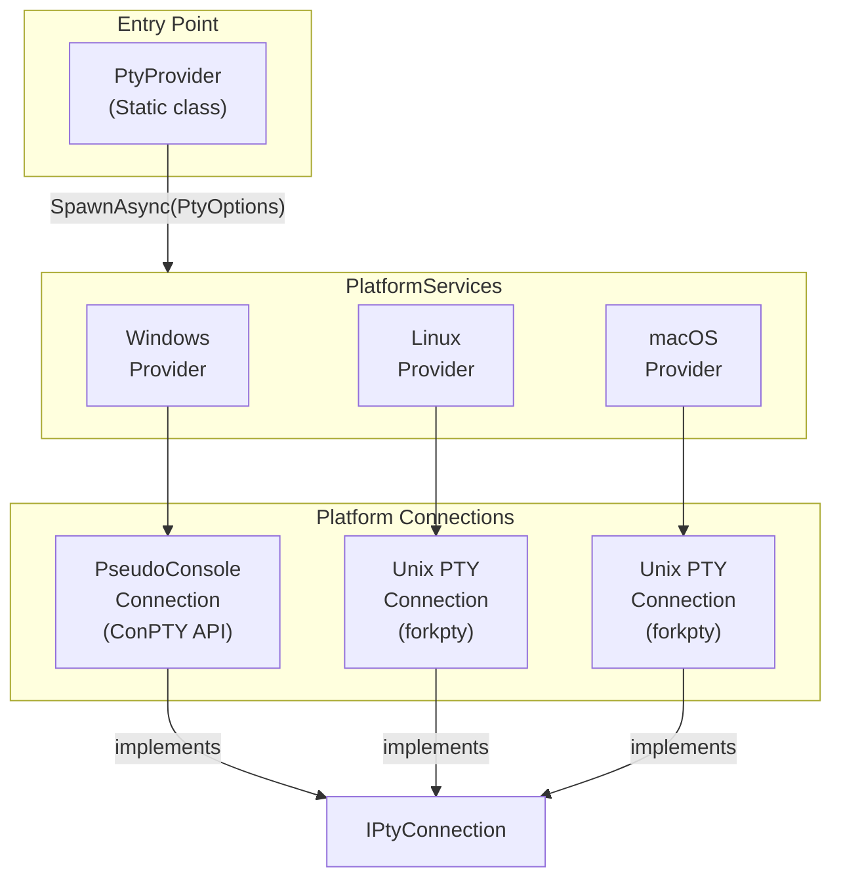

# Porta.Pty

A cross-platform pseudoterminal (PTY) library for .NET that enables spawning and interacting with terminal processes on Windows, Linux, and macOS.

[](https://github.com/tomlm/Porta.Pty/actions/workflows/build-windows.yml)
[](https://github.com/tomlm/Porta.Pty/actions/workflows/build-linux.yml)
[](https://github.com/tomlm/Porta.Pty/actions/workflows/build-macos.yml)

## Features

- **Cross-Platform Support**: Works on Windows (using ConPTY), Linux, and macOS
- **Simple API**: Easy-to-use async API for spawning terminal processes
- **Full PTY Control**: Read/write streams, resize terminal, handle process exit events
- **Unicode Support**: Full UTF-8 support including complex characters
- **.NET Standard 2.0**: Compatible with .NET Core 2.0+, .NET 5+, and .NET Framework 4.6.1+

## Installation

Install via NuGet Package Manager:

```bash
dotnet add package Porta.Pty
```

Or via the Package Manager Console in Visual Studio:

```powershell
Install-Package Porta.Pty
```

## Usage

### Basic Example

```csharp
using Porta.Pty;
using System.Text;

// Configure the terminal options
var options = new PtyOptions
{
    Name = "MyTerminal",
    Cols = 120,
    Rows = 30,
    Cwd = Environment.CurrentDirectory,
    App = RuntimeInformation.IsOSPlatform(OSPlatform.Windows) 
        ? Path.Combine(Environment.SystemDirectory, "cmd.exe") 
        : "/bin/bash",
    Environment = new Dictionary<string, string>
    {
        { "MY_VAR", "value" }
    }
};

// Spawn the terminal process
using IPtyConnection terminal = await PtyProvider.SpawnAsync(options, CancellationToken.None);

// Handle process exit
terminal.ProcessExited += (sender, e) => 
{
    Console.WriteLine($"Terminal exited with code: {e.ExitCode}");
};

// Write to the terminal
byte[] command = Encoding.UTF8.GetBytes("echo Hello World\r");
await terminal.WriterStream.WriteAsync(command, 0, command.Length);
await terminal.WriterStream.FlushAsync();

// Read from the terminal
byte[] buffer = new byte[4096];
int bytesRead = await terminal.ReaderStream.ReadAsync(buffer, 0, buffer.Length);
string output = Encoding.UTF8.GetString(buffer, 0, bytesRead);
Console.WriteLine(output);

// Resize the terminal
terminal.Resize(80, 24);
```

### PtyOptions Properties

| Property | Type | Description |
|----------|------|-------------|
| `Name` | `string?` | Optional terminal name |
| `Cols` | `int` | Initial number of columns |
| `Rows` | `int` | Initial number of rows |
| `Cwd` | `string` | Working directory for the process |
| `App` | `string` | Path to the executable to spawn |
| `CommandLine` | `string[]` | Command line arguments |
| `VerbatimCommandLine` | `bool` | If `true`, arguments are not quoted |
| `Environment` | `IDictionary<string, string>` | Environment variables (empty value removes the variable) |

### IPtyConnection Interface

| Member | Description |
|--------|-------------|
| `ReaderStream` | Stream for reading output from the terminal |
| `WriterStream` | Stream for writing input to the terminal |
| `Pid` | Process ID of the terminal process |
| `ExitCode` | Exit code (available after process exits) |
| `ProcessExited` | Event fired when the process exits |
| `Resize(cols, rows)` | Resize the terminal dimensions |
| `Kill()` | Immediately terminate the process |
| `WaitForExit(ms)` | Wait for process exit with timeout |

## Architecture



### Platform Implementations

#### Windows
- Uses the Windows **ConPTY (Pseudo Console)** API introduced in Windows 10 1809
- Leverages `CreatePseudoConsole`, `ResizePseudoConsole`, and `ClosePseudoConsole` native functions
- Process isolation via Windows Job Objects for clean process termination
- Implements proper cleanup order per Microsoft documentation

#### Linux & macOS
- Uses **POSIX PTY** functions (`forkpty`, `openpty`)
- Sets appropriate terminal environment variables (`TERM=xterm-256color`)
- Clears conflicting environment variables (TMUX, screen sessions)

### Key Components

| Component | Description |
|-----------|-------------|
| `PtyProvider` | Static class providing the `SpawnAsync` entry point |
| `PtyOptions` | Configuration class for terminal spawning |
| `IPtyConnection` | Interface representing an active terminal connection |
| `IPtyProvider` | Internal interface implemented by platform-specific providers |
| `PlatformServices` | Platform detection and provider selection logic |

### Dependencies

- **Vanara.PInvoke.Kernel32**: Windows API P/Invoke bindings
- **Mono.Posix.NETStandard**: POSIX API bindings for Unix platforms

## License

This project is licensed under the MIT License - see the [LICENSE](LICENSE) file for details.

## Contributing

Contributions are welcome! Please feel free to submit a Pull Request.
